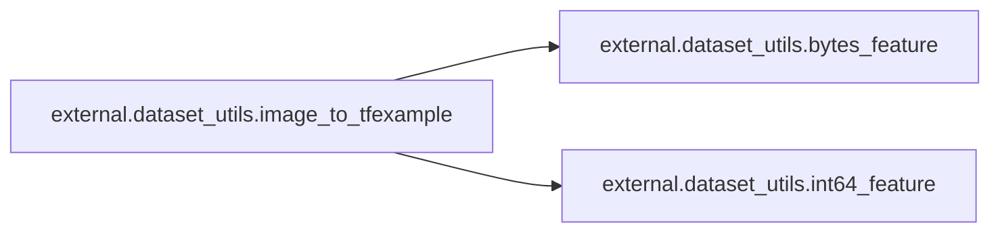

# External Dataset Utils

[_Documentation generated by Documatic_](https://www.documatic.com)

<!---Documatic-section-Codebase Structure-start--->
## Codebase Structure

<!---Documatic-block-system_architecture-start--->
```mermaid
None
```
<!---Documatic-block-system_architecture-end--->

# #
<!---Documatic-section-Codebase Structure-end--->

<!---Documatic-section-external.dataset_utils.int64_feature-start--->
## external.dataset_utils.int64_feature

<!---Documatic-section-int64_feature-start--->
<!---Documatic-block-external.dataset_utils.int64_feature-start--->
<details>
	<summary><code>external.dataset_utils.int64_feature</code> code snippet</summary>

```python
def int64_feature(values):
    if not isinstance(values, (tuple, list)):
        values = [values]
    return tf.train.Feature(int64_list=tf.train.Int64List(value=values))
```
</details>
<!---Documatic-block-external.dataset_utils.int64_feature-end--->
<!---Documatic-section-int64_feature-end--->

# #
<!---Documatic-section-external.dataset_utils.int64_feature-end--->

<!---Documatic-section-external.dataset_utils.bytes_feature-start--->
## external.dataset_utils.bytes_feature

<!---Documatic-section-bytes_feature-start--->
<!---Documatic-block-external.dataset_utils.bytes_feature-start--->
<details>
	<summary><code>external.dataset_utils.bytes_feature</code> code snippet</summary>

```python
def bytes_feature(values):
    return tf.train.Feature(bytes_list=tf.train.BytesList(value=[values]))
```
</details>
<!---Documatic-block-external.dataset_utils.bytes_feature-end--->
<!---Documatic-section-bytes_feature-end--->

# #
<!---Documatic-section-external.dataset_utils.bytes_feature-end--->

<!---Documatic-section-external.dataset_utils.image_to_tfexample-start--->
## external.dataset_utils.image_to_tfexample

<!---Documatic-section-image_to_tfexample-start--->


### Object Calls

* external.dataset_utils.bytes_feature
* external.dataset_utils.int64_feature

<!---Documatic-block-external.dataset_utils.image_to_tfexample-start--->
<details>
	<summary><code>external.dataset_utils.image_to_tfexample</code> code snippet</summary>

```python
def image_to_tfexample(image_data, image_format, height, width, class_id):
    return tf.train.Example(features=tf.train.Features(feature={'image/encoded': bytes_feature(image_data), 'image/format': bytes_feature(image_format), 'image/class/label': int64_feature(class_id), 'image/height': int64_feature(height), 'image/width': int64_feature(width)}))
```
</details>
<!---Documatic-block-external.dataset_utils.image_to_tfexample-end--->
<!---Documatic-section-image_to_tfexample-end--->

# #
<!---Documatic-section-external.dataset_utils.image_to_tfexample-end--->

<!---Documatic-section-external.dataset_utils.download_and_uncompress_tarball-start--->
## external.dataset_utils.download_and_uncompress_tarball

<!---Documatic-section-download_and_uncompress_tarball-start--->
<!---Documatic-block-external.dataset_utils.download_and_uncompress_tarball-start--->
<details>
	<summary><code>external.dataset_utils.download_and_uncompress_tarball</code> code snippet</summary>

```python
def download_and_uncompress_tarball(tarball_url, dataset_dir):
    filename = tarball_url.split('/')[-1]
    filepath = os.path.join(dataset_dir, filename)

    def _progress(count, block_size, total_size):
        sys.stdout.write('\r>> Downloading %s %.1f%%' % (filename, float(count * block_size) / float(total_size) * 100.0))
        sys.stdout.flush()
    (filepath, _) = urllib.request.urlretrieve(tarball_url, filepath, _progress)
    print()
    statinfo = os.stat(filepath)
    print('Successfully downloaded', filename, statinfo.st_size, 'bytes.')
    tarfile.open(filepath, 'r:gz').extractall(dataset_dir)
```
</details>
<!---Documatic-block-external.dataset_utils.download_and_uncompress_tarball-end--->
<!---Documatic-section-download_and_uncompress_tarball-end--->

# #
<!---Documatic-section-external.dataset_utils.download_and_uncompress_tarball-end--->

<!---Documatic-section-external.dataset_utils.write_label_file-start--->
## external.dataset_utils.write_label_file

<!---Documatic-section-write_label_file-start--->
<!---Documatic-block-external.dataset_utils.write_label_file-start--->
<details>
	<summary><code>external.dataset_utils.write_label_file</code> code snippet</summary>

```python
def write_label_file(labels_to_class_names, dataset_dir, filename=LABELS_FILENAME):
    labels_filename = os.path.join(dataset_dir, filename)
    with tf.gfile.Open(labels_filename, 'w') as f:
        for label in labels_to_class_names:
            class_name = labels_to_class_names[label]
            f.write('%d:%s\n' % (label, class_name))
```
</details>
<!---Documatic-block-external.dataset_utils.write_label_file-end--->
<!---Documatic-section-write_label_file-end--->

# #
<!---Documatic-section-external.dataset_utils.write_label_file-end--->

<!---Documatic-section-external.dataset_utils.has_labels-start--->
## external.dataset_utils.has_labels

<!---Documatic-section-has_labels-start--->
<!---Documatic-block-external.dataset_utils.has_labels-start--->
<details>
	<summary><code>external.dataset_utils.has_labels</code> code snippet</summary>

```python
def has_labels(dataset_dir, filename=LABELS_FILENAME):
    return tf.gfile.Exists(os.path.join(dataset_dir, filename))
```
</details>
<!---Documatic-block-external.dataset_utils.has_labels-end--->
<!---Documatic-section-has_labels-end--->

# #
<!---Documatic-section-external.dataset_utils.has_labels-end--->

<!---Documatic-section-external.dataset_utils.read_label_file-start--->
## external.dataset_utils.read_label_file

<!---Documatic-section-read_label_file-start--->
<!---Documatic-block-external.dataset_utils.read_label_file-start--->
<details>
	<summary><code>external.dataset_utils.read_label_file</code> code snippet</summary>

```python
def read_label_file(dataset_dir, filename=LABELS_FILENAME):
    labels_filename = os.path.join(dataset_dir, filename)
    with tf.gfile.Open(labels_filename, 'r') as f:
        lines = f.read().decode()
    lines = lines.split('\n')
    lines = filter(None, lines)
    labels_to_class_names = {}
    for line in lines:
        index = line.index(':')
        labels_to_class_names[int(line[:index])] = line[index + 1:]
    return labels_to_class_names
```
</details>
<!---Documatic-block-external.dataset_utils.read_label_file-end--->
<!---Documatic-section-read_label_file-end--->

# #
<!---Documatic-section-external.dataset_utils.read_label_file-end--->

[_Documentation generated by Documatic_](https://www.documatic.com)