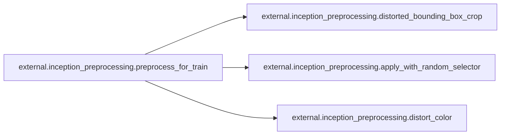
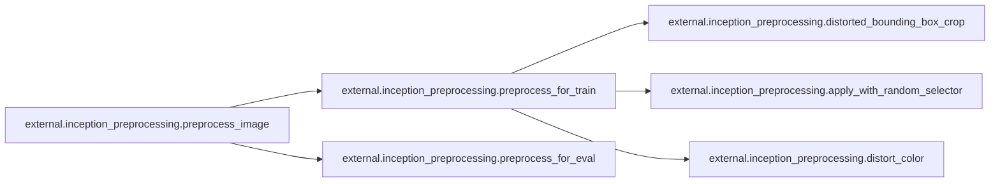

# External Inception Preprocessing

[_Documentation generated by Documatic_](https://www.documatic.com)

<!---Documatic-section-Codebase Structure-start--->
## Codebase Structure

<!---Documatic-block-system_architecture-start--->
```mermaid
None
```
<!---Documatic-block-system_architecture-end--->

# #
<!---Documatic-section-Codebase Structure-end--->

<!---Documatic-section-external.inception_preprocessing.apply_with_random_selector-start--->
## external.inception_preprocessing.apply_with_random_selector

<!---Documatic-section-apply_with_random_selector-start--->
<!---Documatic-block-external.inception_preprocessing.apply_with_random_selector-start--->
<details>
	<summary><code>external.inception_preprocessing.apply_with_random_selector</code> code snippet</summary>

```python
def apply_with_random_selector(x, func, num_cases):
    sel = tf.random_uniform([], maxval=num_cases, dtype=tf.int32)
    return control_flow_ops.merge([func(control_flow_ops.switch(x, tf.equal(sel, case))[1], case) for case in range(num_cases)])[0]
```
</details>
<!---Documatic-block-external.inception_preprocessing.apply_with_random_selector-end--->
<!---Documatic-section-apply_with_random_selector-end--->

# #
<!---Documatic-section-external.inception_preprocessing.apply_with_random_selector-end--->

<!---Documatic-section-external.inception_preprocessing.distort_color-start--->
## external.inception_preprocessing.distort_color

<!---Documatic-section-distort_color-start--->
<!---Documatic-block-external.inception_preprocessing.distort_color-start--->
<details>
	<summary><code>external.inception_preprocessing.distort_color</code> code snippet</summary>

```python
def distort_color(image, color_ordering=0, fast_mode=True, scope=None):
    with tf.name_scope(scope, 'distort_color', [image]):
        if fast_mode:
            if color_ordering == 0:
                image = tf.image.random_brightness(image, max_delta=32.0 / 255.0)
                image = tf.image.random_saturation(image, lower=0.5, upper=1.5)
            else:
                image = tf.image.random_saturation(image, lower=0.5, upper=1.5)
                image = tf.image.random_brightness(image, max_delta=32.0 / 255.0)
        elif color_ordering == 0:
            image = tf.image.random_brightness(image, max_delta=32.0 / 255.0)
            image = tf.image.random_saturation(image, lower=0.5, upper=1.5)
            image = tf.image.random_hue(image, max_delta=0.2)
            image = tf.image.random_contrast(image, lower=0.5, upper=1.5)
        elif color_ordering == 1:
            image = tf.image.random_saturation(image, lower=0.5, upper=1.5)
            image = tf.image.random_brightness(image, max_delta=32.0 / 255.0)
            image = tf.image.random_contrast(image, lower=0.5, upper=1.5)
            image = tf.image.random_hue(image, max_delta=0.2)
        elif color_ordering == 2:
            image = tf.image.random_contrast(image, lower=0.5, upper=1.5)
            image = tf.image.random_hue(image, max_delta=0.2)
            image = tf.image.random_brightness(image, max_delta=32.0 / 255.0)
            image = tf.image.random_saturation(image, lower=0.5, upper=1.5)
        elif color_ordering == 3:
            image = tf.image.random_hue(image, max_delta=0.2)
            image = tf.image.random_saturation(image, lower=0.5, upper=1.5)
            image = tf.image.random_contrast(image, lower=0.5, upper=1.5)
            image = tf.image.random_brightness(image, max_delta=32.0 / 255.0)
        else:
            raise ValueError('color_ordering must be in [0, 3]')
        return tf.clip_by_value(image, 0.0, 1.0)
```
</details>
<!---Documatic-block-external.inception_preprocessing.distort_color-end--->
<!---Documatic-section-distort_color-end--->

# #
<!---Documatic-section-external.inception_preprocessing.distort_color-end--->

<!---Documatic-section-external.inception_preprocessing.distorted_bounding_box_crop-start--->
## external.inception_preprocessing.distorted_bounding_box_crop

<!---Documatic-section-distorted_bounding_box_crop-start--->
<!---Documatic-block-external.inception_preprocessing.distorted_bounding_box_crop-start--->
<details>
	<summary><code>external.inception_preprocessing.distorted_bounding_box_crop</code> code snippet</summary>

```python
def distorted_bounding_box_crop(image, bbox, min_object_covered=0.1, aspect_ratio_range=(0.75, 1.33), area_range=(0.05, 1.0), max_attempts=100, scope=None):
    with tf.name_scope(scope, 'distorted_bounding_box_crop', [image, bbox]):
        sample_distorted_bounding_box = tf.image.sample_distorted_bounding_box(tf.shape(image), bounding_boxes=bbox, min_object_covered=min_object_covered, aspect_ratio_range=aspect_ratio_range, area_range=area_range, max_attempts=max_attempts, use_image_if_no_bounding_boxes=True)
        (bbox_begin, bbox_size, distort_bbox) = sample_distorted_bounding_box
        cropped_image = tf.slice(image, bbox_begin, bbox_size)
        return (cropped_image, distort_bbox)
```
</details>
<!---Documatic-block-external.inception_preprocessing.distorted_bounding_box_crop-end--->
<!---Documatic-section-distorted_bounding_box_crop-end--->

# #
<!---Documatic-section-external.inception_preprocessing.distorted_bounding_box_crop-end--->

<!---Documatic-section-external.inception_preprocessing.preprocess_for_train-start--->
## external.inception_preprocessing.preprocess_for_train

<!---Documatic-section-preprocess_for_train-start--->


### Object Calls

* external.inception_preprocessing.distorted_bounding_box_crop
* external.inception_preprocessing.apply_with_random_selector
* external.inception_preprocessing.distort_color

<!---Documatic-block-external.inception_preprocessing.preprocess_for_train-start--->
<details>
	<summary><code>external.inception_preprocessing.preprocess_for_train</code> code snippet</summary>

```python
def preprocess_for_train(image, height, width, bbox, fast_mode=True, scope=None):
    with tf.name_scope(scope, 'distort_image', [image, height, width, bbox]):
        if bbox is None:
            bbox = tf.constant([0.0, 0.0, 1.0, 1.0], dtype=tf.float32, shape=[1, 1, 4])
        if image.dtype != tf.float32:
            image = tf.image.convert_image_dtype(image, dtype=tf.float32)
        image_with_box = tf.image.draw_bounding_boxes(tf.expand_dims(image, 0), bbox)
        tf.summary.image('image_with_bounding_boxes', image_with_box)
        (distorted_image, distorted_bbox) = distorted_bounding_box_crop(image, bbox)
        distorted_image.set_shape([None, None, 3])
        image_with_distorted_box = tf.image.draw_bounding_boxes(tf.expand_dims(image, 0), distorted_bbox)
        tf.summary.image('images_with_distorted_bounding_box', image_with_distorted_box)
        num_resize_cases = 1 if fast_mode else 4
        distorted_image = apply_with_random_selector(distorted_image, lambda x, method: tf.image.resize_images(x, [height, width], method=method), num_cases=num_resize_cases)
        tf.summary.image('cropped_resized_image', tf.expand_dims(distorted_image, 0))
        distorted_image = tf.image.random_flip_left_right(distorted_image)
        distorted_image = apply_with_random_selector(distorted_image, lambda x, ordering: distort_color(x, ordering, fast_mode), num_cases=4)
        tf.summary.image('final_distorted_image', tf.expand_dims(distorted_image, 0))
        distorted_image = tf.subtract(distorted_image, 0.5)
        distorted_image = tf.multiply(distorted_image, 2.0)
        return distorted_image
```
</details>
<!---Documatic-block-external.inception_preprocessing.preprocess_for_train-end--->
<!---Documatic-section-preprocess_for_train-end--->

# #
<!---Documatic-section-external.inception_preprocessing.preprocess_for_train-end--->

<!---Documatic-section-external.inception_preprocessing.preprocess_for_eval-start--->
## external.inception_preprocessing.preprocess_for_eval

<!---Documatic-section-preprocess_for_eval-start--->
<!---Documatic-block-external.inception_preprocessing.preprocess_for_eval-start--->
<details>
	<summary><code>external.inception_preprocessing.preprocess_for_eval</code> code snippet</summary>

```python
def preprocess_for_eval(image, height, width, central_fraction=0.875, scope=None):
    with tf.name_scope(scope, 'eval_image', [image, height, width]):
        if image.dtype != tf.float32:
            image = tf.image.convert_image_dtype(image, dtype=tf.float32)
        if central_fraction:
            image = tf.image.central_crop(image, central_fraction=central_fraction)
        if height and width:
            image = tf.expand_dims(image, 0)
            image = tf.image.resize_bilinear(image, [height, width], align_corners=False)
            image = tf.squeeze(image, [0])
        image = tf.subtract(image, 0.5)
        image = tf.multiply(image, 2.0)
        return image
```
</details>
<!---Documatic-block-external.inception_preprocessing.preprocess_for_eval-end--->
<!---Documatic-section-preprocess_for_eval-end--->

# #
<!---Documatic-section-external.inception_preprocessing.preprocess_for_eval-end--->

<!---Documatic-section-external.inception_preprocessing.preprocess_image-start--->
## external.inception_preprocessing.preprocess_image

<!---Documatic-section-preprocess_image-start--->


### Object Calls

* external.inception_preprocessing.preprocess_for_train
* external.inception_preprocessing.preprocess_for_eval

<!---Documatic-block-external.inception_preprocessing.preprocess_image-start--->
<details>
	<summary><code>external.inception_preprocessing.preprocess_image</code> code snippet</summary>

```python
def preprocess_image(image, height, width, is_training=False, bbox=None, fast_mode=True):
    if is_training:
        return preprocess_for_train(image, height, width, bbox, fast_mode)
    else:
        return preprocess_for_eval(image, height, width)
```
</details>
<!---Documatic-block-external.inception_preprocessing.preprocess_image-end--->
<!---Documatic-section-preprocess_image-end--->

# #
<!---Documatic-section-external.inception_preprocessing.preprocess_image-end--->

[_Documentation generated by Documatic_](https://www.documatic.com)