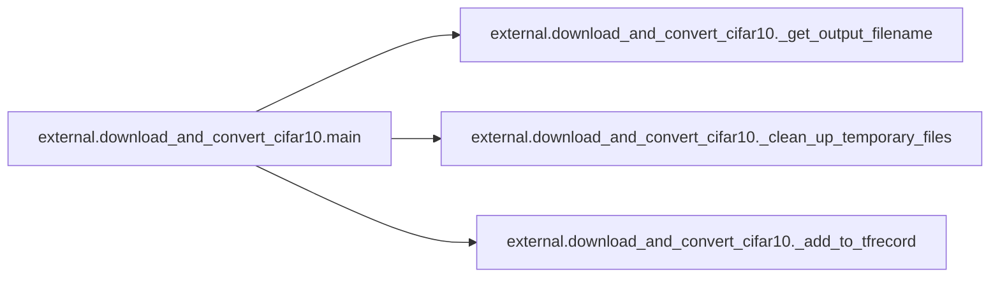

# External Download And Convert Cifar10

[_Documentation generated by Documatic_](https://www.documatic.com)

<!---Documatic-section-Codebase Structure-start--->
## Codebase Structure

<!---Documatic-block-system_architecture-start--->
```mermaid
None
```
<!---Documatic-block-system_architecture-end--->

# #
<!---Documatic-section-Codebase Structure-end--->

<!---Documatic-section-external.download_and_convert_cifar10._add_to_tfrecord-start--->
## external.download_and_convert_cifar10._add_to_tfrecord

<!---Documatic-section-_add_to_tfrecord-start--->
<!---Documatic-block-external.download_and_convert_cifar10._add_to_tfrecord-start--->
<details>
	<summary><code>external.download_and_convert_cifar10._add_to_tfrecord</code> code snippet</summary>

```python
def _add_to_tfrecord(filename, tfrecord_writer, offset=0):
    with tf.gfile.Open(filename, 'r') as f:
        data = cPickle.load(f)
    images = data['data']
    num_images = images.shape[0]
    images = images.reshape((num_images, 3, 32, 32))
    labels = data['labels']
    with tf.Graph().as_default():
        image_placeholder = tf.placeholder(dtype=tf.uint8)
        encoded_image = tf.image.encode_png(image_placeholder)
        with tf.Session('') as sess:
            for j in range(num_images):
                sys.stdout.write('\r>> Reading file [%s] image %d/%d' % (filename, offset + j + 1, offset + num_images))
                sys.stdout.flush()
                image = np.squeeze(images[j]).transpose((1, 2, 0))
                label = labels[j]
                png_string = sess.run(encoded_image, feed_dict={image_placeholder: image})
                example = dataset_utils.image_to_tfexample(png_string, 'png', _IMAGE_SIZE, _IMAGE_SIZE, label)
                tfrecord_writer.write(example.SerializeToString())
    return offset + num_images
```
</details>
<!---Documatic-block-external.download_and_convert_cifar10._add_to_tfrecord-end--->
<!---Documatic-section-_add_to_tfrecord-end--->

# #
<!---Documatic-section-external.download_and_convert_cifar10._add_to_tfrecord-end--->

<!---Documatic-section-external.download_and_convert_cifar10._get_output_filename-start--->
## external.download_and_convert_cifar10._get_output_filename

<!---Documatic-section-_get_output_filename-start--->
<!---Documatic-block-external.download_and_convert_cifar10._get_output_filename-start--->
<details>
	<summary><code>external.download_and_convert_cifar10._get_output_filename</code> code snippet</summary>

```python
def _get_output_filename(dataset_dir, split_name):
    return '%s/cifar10_%s.tfrecord' % (dataset_dir, split_name)
```
</details>
<!---Documatic-block-external.download_and_convert_cifar10._get_output_filename-end--->
<!---Documatic-section-_get_output_filename-end--->

# #
<!---Documatic-section-external.download_and_convert_cifar10._get_output_filename-end--->

<!---Documatic-section-external.download_and_convert_cifar10._download_and_uncompress_dataset-start--->
## external.download_and_convert_cifar10._download_and_uncompress_dataset

<!---Documatic-section-_download_and_uncompress_dataset-start--->
<!---Documatic-block-external.download_and_convert_cifar10._download_and_uncompress_dataset-start--->
<details>
	<summary><code>external.download_and_convert_cifar10._download_and_uncompress_dataset</code> code snippet</summary>

```python
def _download_and_uncompress_dataset(dataset_dir):
    filename = _DATA_URL.split('/')[-1]
    filepath = os.path.join(dataset_dir, filename)
    if not os.path.exists(filepath):

        def _progress(count, block_size, total_size):
            sys.stdout.write('\r>> Downloading %s %.1f%%' % (filename, float(count * block_size) / float(total_size) * 100.0))
            sys.stdout.flush()
        (filepath, _) = urllib.request.urlretrieve(_DATA_URL, filepath, _progress)
        print()
        statinfo = os.stat(filepath)
        print('Successfully downloaded', filename, statinfo.st_size, 'bytes.')
        tarfile.open(filepath, 'r:gz').extractall(dataset_dir)
```
</details>
<!---Documatic-block-external.download_and_convert_cifar10._download_and_uncompress_dataset-end--->
<!---Documatic-section-_download_and_uncompress_dataset-end--->

# #
<!---Documatic-section-external.download_and_convert_cifar10._download_and_uncompress_dataset-end--->

<!---Documatic-section-external.download_and_convert_cifar10._clean_up_temporary_files-start--->
## external.download_and_convert_cifar10._clean_up_temporary_files

<!---Documatic-section-_clean_up_temporary_files-start--->
<!---Documatic-block-external.download_and_convert_cifar10._clean_up_temporary_files-start--->
<details>
	<summary><code>external.download_and_convert_cifar10._clean_up_temporary_files</code> code snippet</summary>

```python
def _clean_up_temporary_files(dataset_dir):
    filename = _DATA_URL.split('/')[-1]
    filepath = os.path.join(dataset_dir, filename)
    tf.gfile.Remove(filepath)
    tmp_dir = os.path.join(dataset_dir, 'cifar-10-batches-py')
    tf.gfile.DeleteRecursively(tmp_dir)
```
</details>
<!---Documatic-block-external.download_and_convert_cifar10._clean_up_temporary_files-end--->
<!---Documatic-section-_clean_up_temporary_files-end--->

# #
<!---Documatic-section-external.download_and_convert_cifar10._clean_up_temporary_files-end--->

<!---Documatic-section-external.download_and_convert_cifar10.main-start--->
## external.download_and_convert_cifar10.main

<!---Documatic-section-main-start--->


### Object Calls

* external.download_and_convert_cifar10._get_output_filename
* external.download_and_convert_cifar10._clean_up_temporary_files
* external.download_and_convert_cifar10._add_to_tfrecord

<!---Documatic-block-external.download_and_convert_cifar10.main-start--->
<details>
	<summary><code>external.download_and_convert_cifar10.main</code> code snippet</summary>

```python
def main(_):
    dataset_dir = FLAGS.dataset_dir
    if not tf.gfile.Exists(dataset_dir):
        tf.gfile.MakeDirs(dataset_dir)
    training_filename = _get_output_filename(dataset_dir, 'train')
    testing_filename = _get_output_filename(dataset_dir, 'test')
    if tf.gfile.Exists(training_filename) and tf.gfile.Exists(testing_filename):
        print('Dataset files already exist. Exiting without re-creating them.')
        return
    dataset_utils.download_and_uncompress_tarball(_DATA_URL, dataset_dir)
    with tf.python_io.TFRecordWriter(training_filename) as tfrecord_writer:
        offset = 0
        for i in range(_NUM_TRAIN_FILES):
            filename = os.path.join(dataset_dir, 'cifar-10-batches-py', 'data_batch_%d' % (i + 1))
            offset = _add_to_tfrecord(filename, tfrecord_writer, offset)
    with tf.python_io.TFRecordWriter(testing_filename) as tfrecord_writer:
        filename = os.path.join(dataset_dir, 'cifar-10-batches-py', 'test_batch')
        _add_to_tfrecord(filename, tfrecord_writer)
    labels_to_class_names = dict(zip(range(len(_CLASS_NAMES)), _CLASS_NAMES))
    dataset_utils.write_label_file(labels_to_class_names, dataset_dir)
    _clean_up_temporary_files(dataset_dir)
    print('\nFinished converting the Cifar10 dataset!')
```
</details>
<!---Documatic-block-external.download_and_convert_cifar10.main-end--->
<!---Documatic-section-main-end--->

# #
<!---Documatic-section-external.download_and_convert_cifar10.main-end--->

[_Documentation generated by Documatic_](https://www.documatic.com)